# Hi, I'm Xiaoyi 🐱

Full-stack engineer building cloud services, developer tools, and small products that make everyday life more interesting.

[Blog](https://xymeow.github.io/) · [LinkedIn](https://www.linkedin.com/in/xiaoyihe1311/)

### At work

I'm currently a **Tech Lead on Oracle Cloud Marketplace**, where I've worked since 2020 across frontend, backend, infrastructure, and operations.

- Lead the Public Marketplace rebuild with the team, shaping frontend and backend design, service boundaries, and delivery. Coordinate cross-functional work with Compute, Image, and Resource Manager teams to bring connected features together.
- Take Service Catalog features from architecture through implementation and release, and contribute to platform migrations and service decoupling.
- Improve deployment automation, CI/CD, monitoring, and troubleshooting across OCI environments. Learn from other internal teams' CI/CD practices and guide engineers through implementation and reviews.

### Selected Personal Projects

**City Whisper · 听城** — Discover the stories behind the places you pass every day, or explore a city from your sofa. Short, sourced stories are connected to real places. I independently design, develop, and release the product, including its mobile app, native integrations, and content delivery pipeline.  
*React Native / Expo · TypeScript · Swift · Cloudflare Workers & R2*  
[Website](https://citywhisper.net/) · [App Store](https://apps.apple.com/app/id6780022165)

**Telegram Chatbot Agent** — A personal Telegram agent with persistent sessions, per-chat memory, custom MCP tools, scheduled tasks, and concurrency control. Includes Terraform-based OCI deployment. Currently offline—the cloud agent was a little too expensive to keep running.  
*TypeScript · Claude Agent SDK · MCP · SQLite · Python · Terraform / OCI*

**[Anime Style for Three.js](https://github.com/xymeow/three-anime-style)** — A reusable rendering library that adds cel shading, painted scenery, pen outlines, and film texture to existing Three.js scenes. Includes a model playground and integration examples.  
*TypeScript · Three.js / WebGL · GitHub Actions*  
[Source](https://github.com/xymeow/three-anime-style) · [Playground](https://xymeow.github.io/three-anime-style/)

Also: [Stack-chan Matchday](https://github.com/xymeow/stackchan-matchday), a robot match companion built on the upstream Stack-chan platform, with a Python watcher and phone-based setup.

### Tools I work with

**Core**

             

**Other project experience**

          

Historical / school projects

C++ was used in earlier school projects.

B.Eng. in Computer Science, **USTC** · M.S. in Computer Science, **USC**

### Contribution playground

*Original animation layout preview using synthetic cells. Real GitHub contribution-calendar data is not connected yet; this is not a contribution or commit statistic.*
